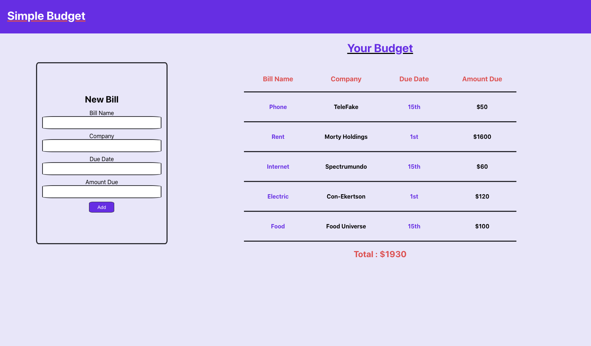

# React Budget App

A basic react project to practice my react skills and use [styled-components](https://styled-components.com/). I also added [Airtable](https://airtable.com/) for some basic CRUD. It just tallies up your monthly bills and allows you to add more bills.

## Things this helped me practice:

- State mangement.
- Component based thinking, breaking everything into much smaller pieces.
- Styled Compnents.
- Adding an API into a react app.

### Picture of the App - I didn't spend much time really on the design.

